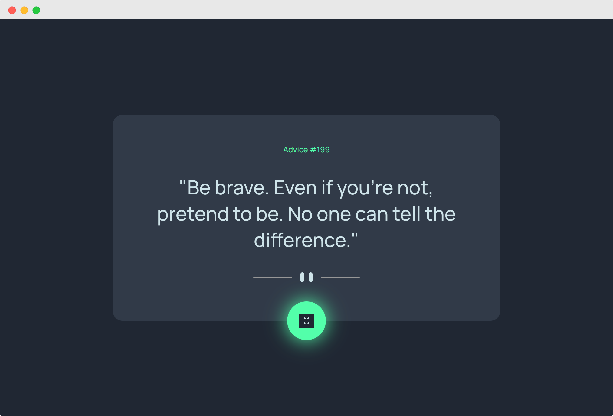

# FrontendMentor Challenge | Advice Generator App

This is a challenge from FrontendMentor.   
You can find the description of the task here:   
[frontendmentor.io](https://www.frontendmentor.io/challenges/advice-generator-app-QdUG-13db)



My goal in this challenge was to:
- Make first steps with Angular
- Do a nice animation with the dice

### How to run
```bash
git clone git@github.com:jeromehaas/advice-generator-app-fm.git
cd advice-generator-app-fm
nvm use
npm install 
npm start
```